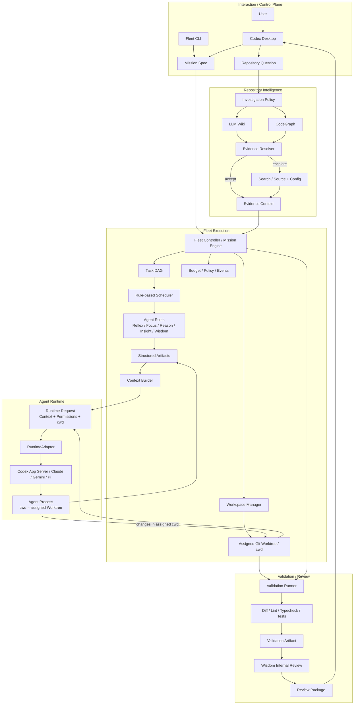

# Agent Fleet 最终架构

## 总体架构



## Repository Intelligence 回退链

```mermaid
flowchart LR
    QUESTION["Repository Question"] --> POLICY["Investigation Policy"]
    POLICY --> WIKI["LLM Wiki"]
    POLICY --> GRAPH["CodeGraph"]
    WIKI --> RESOLVER["Evidence Resolver"]
    GRAPH --> RESOLVER
    RESOLVER -->|"accept"| CONTEXT["Evidence Context"]
    RESOLVER -->|"escalate"| SEARCH["Native Search"]
    SEARCH --> STATIC["Source + Configuration"]
    STATIC --> CONTEXT
    STATIC -->|"high-risk claim"| COMPILER["LSP / Compiler"]
    COMPILER --> TESTS["Tests / Runtime"]
    COMPILER --> CONTEXT
    TESTS --> CONTEXT
    CONTEXT --> FOCUS["Focus / Investigation"]
    FOCUS --> REASON["Reason / Planning + Implementation"]
    REASON --> INSIGHT["Insight / Verification Evidence"]
    INSIGHT --> WISDOM["Wisdom / Review"]
```



## 边界与原则

- `Repository Question` 进入 `Investigation Policy`；Wiki 和 CodeGraph 按问题类型并行选择，不是固定串行流水线。
- `Evidence Resolver` 同时评估 Wiki、CodeGraph 和后续源码证据；缺失、歧义、过期或高风险时升级到 Search、Source、Compiler 和 Tests。
- `Mission Spec` 是 Codex Desktop 或 Fleet CLI 进入 Fleet 的正式契约。
- Codex Desktop 负责需求讨论和最终审阅，不属于 Fleet Runtime，也不由 Fleet 控制其 UI。
- Fleet Controller 负责 Mission、Task DAG、Scheduler、Validation Runner 和执行状态。
- 角色采用认知五级命名：Reflex（快速分诊与琐碎任务直处理，轻量写入）、Focus（只读定位调查）、Reason（规划与深度实现，唯一深度写者，可在实现过程中运行测试）、Insight（只读验证取证与影响分析）、Wisdom（只读内部审阅与裁决）。
- 命名映射（历史）：Terra → Focus + Insight；Sol → Reason（规划）+ Wisdom（审阅）；Luna → Reason（实现）。
- 最终 Validation 必须由 Fleet 独立执行，Reason / Reflex 不能自己判定任务完成。
- Agent 之间通过结构化 Artifact 传递结果，不依赖完整聊天记录互相通信。
- `Workspace Manager` 拥有 Workspace 和 Git Worktree；Runtime 只接收被分配的 `cwd`。
- `RuntimeAdapter` 隔离具体模型和运行时，Fleet Core 不依赖某一家 Agent CLI。
- `Static Truth = Source + Configuration`；`Behavior Truth = Tests + Runtime`。
- Wiki 是知识加速器，CodeGraph 是结构加速器；两者都不是 Fleet 的生存依赖。
- 最终通过 Validation Artifact、Wisdom Internal Review 和 Review Package 回到 Codex Desktop。

## 最小实现顺序

```text
Mission Spec / Core Domain
  ↓
Task DAG + Rule-based Scheduler + Fake Runtime
  ↓
Artifact / Workspace / Budget
  ↓
Context Builder
  ↓
Validation Runner + Review Package
  ↓
Investigation Policy + Source Fallback
  ↓
RuntimeAdapter
  ↓
Codex App Server / 其他 Agent Runtime
```
